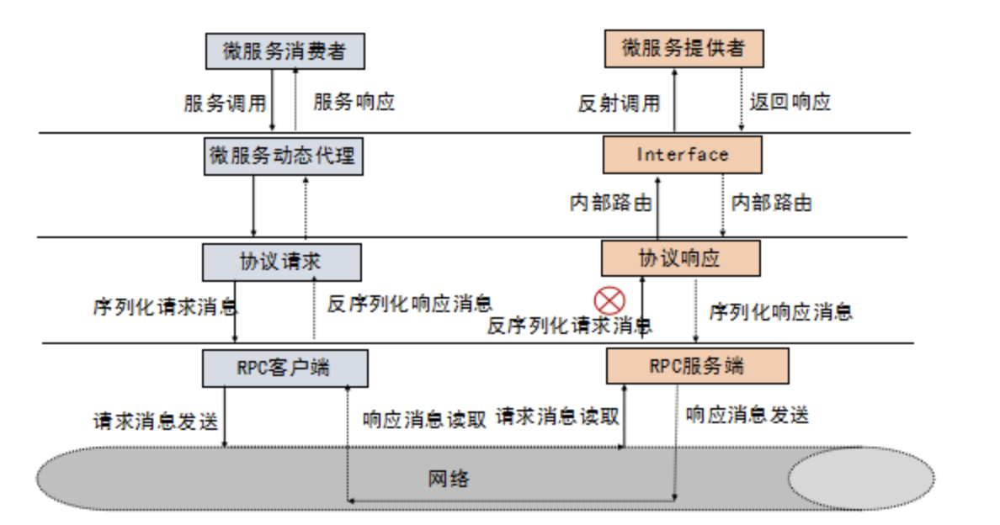

### rpc框架原理
RPC 框架的目标就是让远程服务调用更加简单、透明，RPC框架负责屏蔽底层的传输方式（TCP或者UDP）、序列化方式(XML/Json/二进制)和通信细节。服务调用者可以像调用本地接口一样调用远程的服务提供者，而不需要关心底层通信细节和调用过程。

### 主流RPC框架
整体分为三类：
    1. 支持多语言的 RPC 框架，比较成熟的有Google 的 gRPC、Apache的Thrift
    2. 只支持特定语言的 RPC 框架，例如新浪微博的 Motan;
    3. 支持服务治理等服务化特性的分布式服务框架，其底层内核仍然是RPC框架，例如阿里的 Dubbo.

随着微服务的发展，基于语言中立性原则构建微服务，逐渐成为一种主流模式，例如对于后端并发处理要求高的微服务，比较适合采用Go语言构建，而对于前端的 Web 界面，则更适合 Java和JavaScript.

